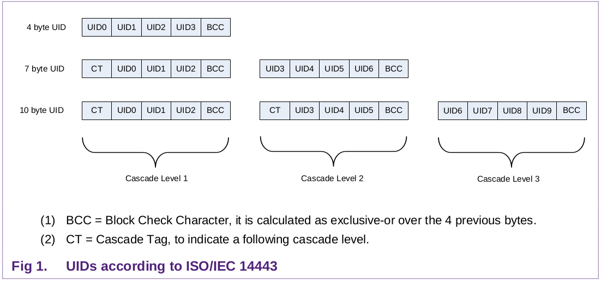

# MIFARE

Trademark owned by NXP

ISO-14443, type A

Variants:

* Classic
* Plus
* Ultralight
* DESFire

## MIFARE Classic

Basic storage device with simple security features for access control (:warning:Has been compromised :ok\_hand:)

## MIFARE Plus

Replacement for (and more secure than) MIFARE Classic

MIFARE Plus EV1 and EV2 are improvemens of MIFARE Plus

## MIFARE Ultralight

Very inecpensice, no cryptography features

## MIFARE DESFire

More hardware and software features than MIFARE Classic, comes with an OS and directoy file structure

## Card UID

<figure><figcaption></figcaption></figure>
